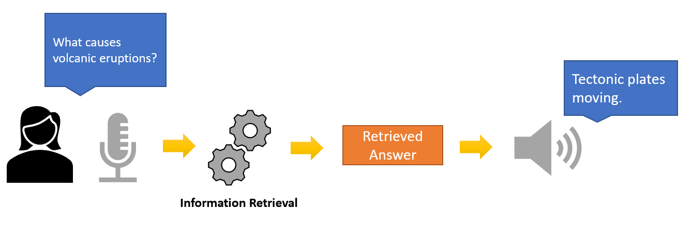
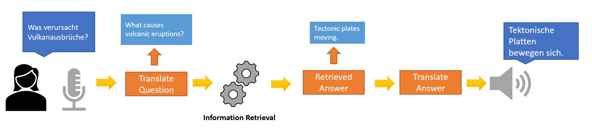

# Speech-Based Information Retrieval for Answering Science Questions


## This example shows how to retrieve answers from a knowledge base via speech recognition and information retrieval:
* Record and read audio data in MATLAB&reg; using the [Audio Toolbox&trade;](https://www.mathworks.com/products/audio.html)
* Translate questions to English using Hugging Face&reg; Transformers using co-execution with Python&reg;
* Retrieve answers for science questions using Information Retrieval techniques via [Text Analytics Toolbox&trade;](https://www.mathworks.com/products/text-analytics.html)

## Requirements 

* [MATLAB&reg; R2022a or later](https://www.mathworks.com/products/matlab.html)
* [Text Analytics Toolbox&trade;](https://www.mathworks.com/products/text-analytics.html)
* [Audio Toolbox&trade;](https://www.mathworks.com/products/audio.html)
    * [speech2text](https://www.mathworks.com/matlabcentral/fileexchange/65266-speech2text)
    * [text2speech](https://www.mathworks.com/matlabcentral/fileexchange/73326-text2speech)
* [Python&reg; 3.8+](https://www.python.org/downloads/)
* [PyTorch&reg; 1.11.0](https://pytorch.org/)
* [Hugging Face&reg; Transformers 4.17.0+](https://huggingface.co/docs/transformers/index)

## Setup

In this example, you use the train split of the QASC Data Set [1] as a knowledge base for pairs of answers and questions. This dataset contains questions and answers about grade school science, such as "Fossils are formed when what happens?".
While the dataset contains questions and multiple alternatives for the correct answer, the preprocessing step filters only the correct answer.

To download the data set and preprocess the data, run the script `downloadAndPreprocessData`. 
```Matlab:Code(Display)
>> downloadAndPreprocessData
```

The script saves the preprocessed data to the file `questions_answers.mat` inside the `text_data` folder.

## Overview

Using this example, you can ask questions and retrieve answers with the following steps:

1. Ask your question using an audio input device, such as your microphone, or using a pre-recorded question 
2. Use the speech2text functionality to convert your question to text form
2. If you want to ask a question in a different language, use a pretrained transformer model to translate your question to English
3. Compare your question with the questions in the knowledge base and retrieve the most similar question and answer using TF-IDF
4. If you want your answer in a different language, translate it again using the transformer model
5. Use the text2speech functionality to convert your answer to audio form and output it

## Asking Questions in English



If you want to ask questions in English, you don't have to translate them, since the knowledge base is already in English.

For asking questions while the script is running, you will have to use an input device and ask your question when you see the message 'Start speaking.' after running the following script:

```Matlab:Code(Display)
>> englishRetrieval
```

If you have a pre-recorded question, you can also use this example. You can find some pre-recorded English questions examples inside `audio_data\en` and run the example using:

```Matlab:Code(Display)
>> audioFileEnglishRetrieval
```

For using your own files as input, you can change the variable `inputAudioFile` to your file location.

## Asking Questions in Other Languages



If you want to ask question in another language, other than English, you will need to translate your question to English. This is done in this example using a pretrained transformer model from Hugging Face.
In this example, we show how to ask questions and get answers in German, which is a language supported by Text Analytics Toolbox. However, you can change the variable `inputLanguage` to different language codes if you want.

Again, for asking questions while the script is running, you will have to use an input device and ask your question when you see the message 'Begin recording...' after running the following script:

```Matlab:Code(Display)
>> nonEnglishRetrieval
```

Similarly, if you have a pre-recorded question in a different language than English, you can also use this example. You can find some pre-recorded German questions examples inside `audio_data\de` and run the example using:

```Matlab:Code(Display)
>> englishRetrieval
```


## References

[1] Khot, T., Clark, P., Guerquin, M., Jansen, P., & Sabharwal, A. (2020, April). Qasc: A dataset for question answering via sentence composition. In Proceedings of the AAAI Conference on Artificial Intelligence (Vol. 34, No. 05, pp. 8082-8090).

Copyright 2022, The MathWorks, Inc.
